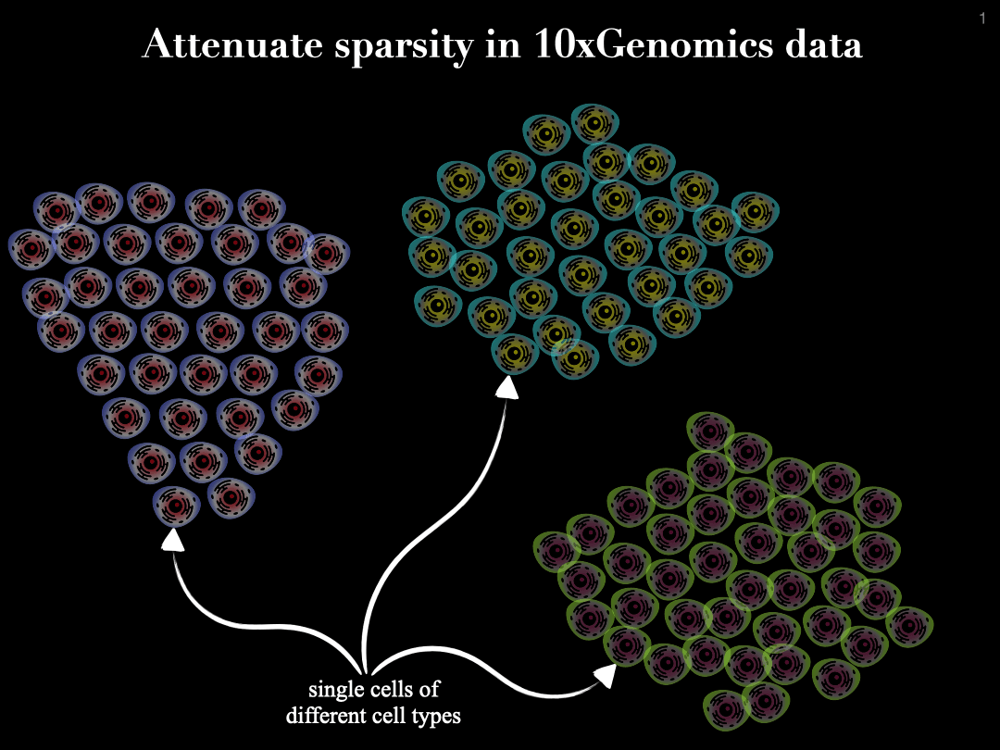

# MetaCellaR
Single-cell sequencing enables genome-wide measurement at single cell resolution. However, this type of data is commonly very sparse, and often this sparsity emerges from technical issues, which in turn leads to having a weaker signal.
This sparsity often popses a problem for machine learning approaches, which rely on using such data for building a meaningful and powerful model, e.g., during their training phase.

To tackle and attenuate the sparsity in the single-cell data, we propose a cell summarization strategy, in where the similar cells (similarity based on their gene expression profile) are aggregated together to empower the signal within the data.

MetaCellaR is an R package to summerize single cells based on k-medoids. The clustering is done per cell type. We refer to these clusters as metacells.
Essentially, we compute the center of each metacell (by averaginf the gene expression profiles of cells that are grouped together into the same cluster) and consider this as the expression profile of a metacell. The gif below illustrates this procedure:
 

The input arguments to our MetaCellaR script are:
- Specify the input format of the RNA-seq data using the `csv_flag` argument.
- Use the `file_name` argument to specify the file path to where the single cell, either a csv file or a Seurat object, is stored. In case of the csv file, the rows and columns must be annotated by gene names and cell names, respectively.
- In case of a csv input file explained above, the `celltype_info` argument must be a 2-column table containing the mapping for cells to their cell types. First column must be the same as cell names provided in the csv file, and second column the cell types. In case of the Seurat object, the `celltype_info` argument must be used to refer to the slot where the cell type annotation of single cells are stored in the Suerat object.
- `RNA_count_slot` is used only for the Seurat object. This argument refers to the slot where the RNA counts are stored in the Suerat object. For instance, if the full way to access the RNA counts stored in a Seurat object called `S` is to call `S@assays$RNA@counts` then the user needs to type in `-RNA assays$RNA@counts` to indicate that the single cell gene expression counts are accessible via those slots/items.
- `ATAC_count_slot` is used only for the Seurat object. This argument refers to the slot where the ATAC counts are stored in the Suerat object. For instance, is the full way to access the ATAC counts stored in a Seurat object called `S` is to call `S@assays$ATAC@counts`, then the argument passed to `ATAC_count_slot` should be 'assays$ATAC@counts'.
- Argument `k` can be used to specify the number of clusters for the k-medoids clustering. If not provided by the user, `k` is defined based on the number of potential groups that have at least 30 cells inside (k <- #cells in a cell type / 30)
- Use the `assay_slot` argument followed by the slot where the assay information are stored. The goal is to tell MetaCellaR where the cells from the scRNA-seq data should be accessed to compute the metacells. The valid names to refer to the scRNA-seq assay are (case insensitive): "scrna-seq", "scrna", "scrna", and "rna".
- `-umap` is a boolean argument which if set to TRUE will project the RNA expression counts to a UMAP space of (by default) 20 components (see `umap_dim` option for adjusting this value). These components are then used to generate the clusters. Setting this argument to TRUE will substantially *increase* the runtime *speed*.
- If `umap_flag` is provided, the user can accompany it with the `umap_dim` option allowing to specify the number of dimentions the umap function should reduce the data to. In other words, `umap_dim` is an integer argument indicating the number of UMAP dimensions (default is 20).
- `expected_cells` allows the user to set the number of expected cells per metacell. The defaults is 30. A greedy algorithm is run, after clustering, to merge the low cell count metacells (those that have fewer cells than this expected numberi) to reach to the this desired value.
- `reduction` provides the user the flexibity to use any cell embedding method for integrating scRNA and scATAC datasets. The default is "umap" that comes with a default integrated Seurat object. But, if the user used another integration method, they can tell MetaCellaR to use the cell embedding of the integration of interest through the `-reduction` argument.
- The k-NN implementation requires a capping threshold, `threshold`, on the number of ATAC cells assigned to a metacell. If this number exceeds the threshold, the algorithm will pick the next closest metacell for labeling. The default value is 3 * `expected_cells`. This option should be used only when the ATAC data is availbe.
- To specify an output directory in where the results will be stored, the user can supply the `-output` argument.
- `gtf_file` is used to pass the path to a gtf file corresponding to the genome version the RNA reads were aligned to. This is used to obtain the exonic length for the normalization of RNA reads.
